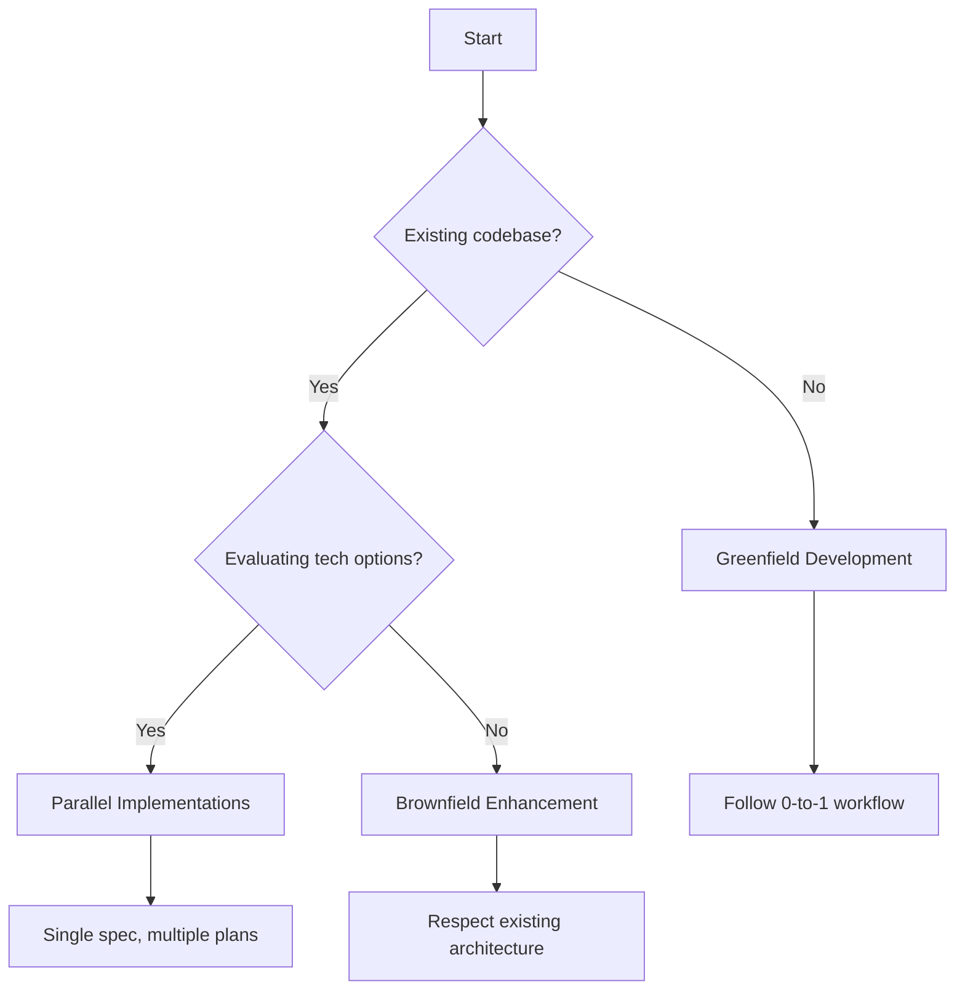

Spec-Driven Development adapts to different project phases and development scenarios. These examples demonstrate how to apply SDD principles whether you're starting from scratch, enhancing existing systems, or exploring multiple technical approaches.

## The Three Development Phases

SDD supports three distinct development patterns, each with unique characteristics and workflows:

<CardGroup cols={3}>
  <Card title="0-to-1 (Greenfield)" icon="seedling" href="/examples/greenfield-project">
    Build new projects from initial concept to production-ready code
  </Card>
  
  <Card title="Brownfield Enhancement" icon="wrench" href="/examples/brownfield-enhancement">
    Add features to existing codebases while maintaining architectural integrity
  </Card>
  
  <Card title="Parallel Implementations" icon="code-branch" href="/examples/parallel-implementations">
    Explore multiple tech stacks from a single specification
  </Card>
</CardGroup>

## Greenfield Development (0-to-1)

**Focus**: Generate from scratch

<Accordion title="When to use">
  - Starting a new project with no existing code
  - Building a proof-of-concept or MVP
  - Creating a new microservice in a greenfield architecture
  - Prototyping a product idea rapidly
</Accordion>

**Key activities:**
- Start with high-level requirements and user stories
- Generate complete specifications with acceptance criteria
- Plan implementation steps and architecture from scratch
- Build production-ready applications with full test coverage

**Example projects:**
- New SaaS products (task management, analytics dashboards)
- CLI tools (deployment automation, data migration)
- Internal libraries (authentication, data validation)

<Card title="Complete Walkthrough" icon="map" href="/examples/greenfield-project">
  Build a photo album organizer from zero to production
</Card>

---

## Brownfield Enhancement (Iterative)

**Focus**: Add features to existing systems

<Accordion title="When to use">
  - Extending an existing application with new features
  - Modernizing legacy systems incrementally
  - Adapting existing processes to new requirements
  - Refactoring while maintaining functionality
</Accordion>

**Key activities:**
- Analyze existing architecture and constraints
- Create specifications that respect current design patterns
- Plan features that integrate seamlessly with existing code
- Modernize incrementally without breaking changes

**Example scenarios:**
- Adding OAuth2 login to an app with email/password auth
- Implementing a REST API for an existing CLI tool
- Creating a dashboard for a system with no UI
- Adding real-time updates to a polling-based application

<Card title="Feature Addition Guide" icon="plus" href="/examples/brownfield-enhancement">
  Add real-time notifications to an existing task management system
</Card>

---

## Creative Exploration (Parallel Implementations)

**Focus**: Experiment with diverse solutions

<Accordion title="When to use">
  - Evaluating different technology stacks for the same requirements
  - Optimizing for different constraints (performance, cost, maintainability)
  - Exploring UX patterns before committing to one
  - Building platform-specific versions (web, mobile, desktop)
</Accordion>

**Key activities:**
- Create a single, technology-agnostic specification
- Generate multiple implementation plans targeting different stacks
- Build parallel prototypes to compare approaches
- Validate the hypothesis that SDD transcends specific technologies

**Example explorations:**
- Web dashboard: React vs. Vue vs. Svelte vs. vanilla JS
- API service: Python/FastAPI vs. Go/Gin vs. Rust/Axum
- Mobile app: React Native vs. Flutter vs. Swift/Kotlin native
- CLI tool: Python/Click vs. Go/Cobra vs. Rust/Clap

<Card title="Multi-Stack Exploration" icon="sitemap" href="/examples/parallel-implementations">
  Implement the same chat feature in 3 different tech stacks
</Card>

---

## Choosing Your Path

Use this decision tree to select the right approach:

<Steps>
  <Step title="No existing code">
    **→ Greenfield Development**
    
    Start with `/speckit.constitution` to establish principles, then proceed through the full SDD workflow.
  </Step>
  
  <Step title="Extending existing system">
    **→ Brownfield Enhancement**
    
    Analyze current architecture first, then create specifications that integrate cleanly.
  </Step>
  
  <Step title="Exploring options">
    **→ Parallel Implementations**
    
    Write one specification, generate multiple plans targeting different stacks.
  </Step>
</Steps>

## What You'll Learn

Each tutorial demonstrates:

<CardGroup cols={2}>
  <Card title="Complete Command Flow" icon="terminal">
    Every `/speckit.*` command with real prompts and outputs
  </Card>
  
  <Card title="Decision Points" icon="arrows-split-up-and-left">
    When to clarify, when to iterate, when to regenerate
  </Card>
  
  <Card title="Quality Validation" icon="check-circle">
    Using checklists and analysis to ensure completeness
  </Card>
  
  <Card title="Common Pitfalls" icon="triangle-exclamation">
    Mistakes to avoid and how to recover from them
  </Card>
</CardGroup>

## Tutorial Structure

Each example follows this format:

1. **Scenario Setup**: The problem you're solving
2. **Step-by-Step Commands**: Actual `/speckit.*` commands with prompts
3. **Generated Artifacts**: What the AI produces at each step
4. **Validation Checkpoints**: How to verify quality before proceeding
5. **Common Issues**: Troubleshooting and iteration strategies
6. **Final Output**: The complete working implementation

## Before You Begin

Make sure you've completed:

<Steps>
  <Step title="Installation">
    Install Spec Kit and configure your AI assistant
    
    [Installation Guide →](/installation)
  </Step>
  
  <Step title="Quick Start">
    Complete the quick start to understand basic workflow
    
    [Quick Start →](/quickstart)
  </Step>
  
  <Step title="Core Concepts">
    Read about SDD philosophy and workflow
    
    [Core Concepts →](/concepts/spec-driven-development)
  </Step>
</Steps>

## Example Complexity

<Note>
  **Recommended learning path**:
  
  1. Start with **Greenfield Development** to learn the full workflow
  2. Then try **Brownfield Enhancement** to understand integration
  3. Finally explore **Parallel Implementations** for advanced patterns
</Note>

| Tutorial | Complexity | Time | Prerequisites |
|----------|-----------|------|---------------|
| Greenfield Project | Beginner | 30-45 min | Installation complete |
| Brownfield Enhancement | Intermediate | 45-60 min | Understand greenfield workflow |
| Parallel Implementations | Advanced | 60-90 min | Comfortable with SDD process |

## Additional Resources

<CardGroup cols={2}>
  <Card title="Command Reference" icon="book" href="/commands/overview">
    Detailed documentation for all `/speckit.*` commands
  </Card>
  
  <Card title="Troubleshooting" icon="screwdriver-wrench" href="/advanced/troubleshooting">
    Solutions to common issues and error messages
  </Card>
  
  <Card title="Templates" icon="file-code" href="/advanced/templates">
    Understanding and customizing specification templates
  </Card>
  
  <Card title="Community Examples" icon="users" href="/community/overview">
    More examples from the Spec Kit community
  </Card>
</CardGroup>

## Next Steps

<CardGroup cols={3}>
  <Card title="Greenfield Tutorial" icon="seedling" href="/examples/greenfield-project">
    Build a photo organizer from scratch
  </Card>
  
  <Card title="Brownfield Tutorial" icon="wrench" href="/examples/brownfield-enhancement">
    Add notifications to existing system
  </Card>
  
  <Card title="Parallel Exploration" icon="code-branch" href="/examples/parallel-implementations">
    Compare multiple tech stacks
  </Card>
</CardGroup>
