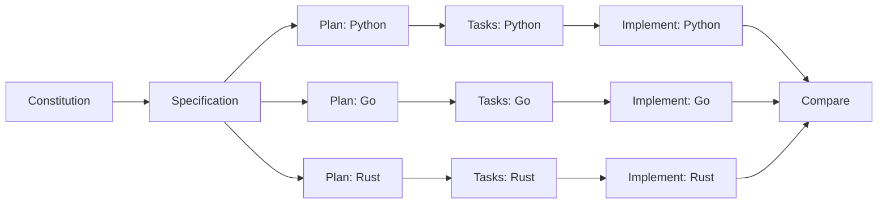

This tutorial demonstrates SDD's power to generate multiple implementations from a single specification. You'll create a real-time chat feature and explore it with Python/FastAPI, Go/Gin, and Rust/Axum—all from one technology-agnostic spec.

<Info>
  **Time to complete**: 60-90 minutes
  
  **What you'll build**: Chat feature with 3 parallel implementations
  
  **Prerequisites**: Comfortable with SDD workflow, completed greenfield tutorial
</Info>

## The Scenario

You're architecting a real-time chat system and need to evaluate different backend technologies. Rather than building prototypes from scratch or relying on theoretical comparisons, you want **working implementations** to compare:

- **Performance**: Latency, throughput, memory usage
- **Developer Experience**: Code clarity, tooling, debugging
- **Operational Characteristics**: Deployment, monitoring, resource consumption
- **Ecosystem**: Library support, community, long-term viability

**The experiment:**

Create a single specification for a chat feature, then generate three implementations:

<CardGroup cols={3}>
  <Card title="Python/FastAPI" icon="python">
    Rapid development, rich ecosystem, strong typing
  </Card>
  
  <Card title="Go/Gin" icon="golang">
    High performance, simple concurrency, easy deployment
  </Card>
  
  <Card title="Rust/Axum" icon="rust">
    Maximum performance, memory safety, zero-cost abstractions
  </Card>
</CardGroup>

## Why Parallel Implementations

Parallel implementations validate SDD's core hypothesis:

<Note>
  **Specifications transcend technology**. If done right, a single spec can generate functionally equivalent implementations in different languages and frameworks.
</Note>

**Benefits:**

- **Apples-to-apples comparison**: Same features, different tech
- **De-risk technology choices**: Try before you commit
- **Platform-specific optimizations**: Tailor to different constraints
- **Organizational flexibility**: Teams can choose preferred stack

## The Workflow

Parallel implementations follow a modified SDD process:



<Warning>
  **Key difference**: One specification generates **multiple plans**, one per tech stack. Each plan then generates its own tasks and implementation.
</Warning>

## Step 1: Initialize Project

Create a project that will house multiple implementations:

```bash
# Create project
specify init chat-comparison --ai claude

cd chat-comparison

# Launch AI assistant
claude
```

**Project structure:**

```text
chat-comparison/
├── .specify/              # Shared SDD artifacts
│   ├── memory/
│   │   └── constitution.md  # Shared principles
│   ├── specs/
│   │   └── 001-chat-feature/
│   │       └── spec.md      # Single specification
│   └── templates/
├── python-impl/           # Python/FastAPI implementation
├── go-impl/               # Go/Gin implementation
└── rust-impl/             # Rust/Axum implementation
```

## Step 2: Create Technology-Agnostic Constitution

Define principles that apply to **all implementations**:

```text
/speckit.constitution Create technology-agnostic principles that apply 
regardless of programming language:
1. All implementations MUST provide identical REST API contracts
2. WebSocket protocol MUST be compatible across all versions
3. Performance target: <50ms p95 latency for message delivery
4. Security: JWT authentication with same token format
5. Data format: JSON for all API responses
6. Observability: Structured logging with consistent schema
7. Testing: Minimum 80% code coverage for all implementations
8. Each implementation MUST be independently deployable
```

**Generated constitution:**

<Accordion title="Technology-Agnostic Constitution">
```markdown
# Chat System Constitution

## Principles

### Article I: API Contract Consistency
All implementations MUST expose identical REST and WebSocket APIs.

**Rules:**
- Same endpoint paths (`/api/v1/messages`, `/ws/chat`)
- Same request/response JSON schemas
- Same HTTP status codes for errors
- Same WebSocket message formats

**Rationale**: Clients should not need to know which backend they're using.

**Validation**: OpenAPI spec defines contract; implementations tested against it.

### Article II: Performance Parity
All implementations MUST meet the same performance targets.

**Rules:**
- Message delivery: <50ms p95 latency
- WebSocket connections: Support 1,000 concurrent
- Memory usage: <100MB for 1,000 connections
- Startup time: <5 seconds

**Rationale**: Fair comparison requires similar performance characteristics.

**Validation**: Load tests with same test harness (k6 or Locust).

### Article III: Security Equivalence
All implementations MUST provide equivalent security.

**Rules:**
- JWT authentication with HS256 algorithm
- Same token structure and claims
- Same token expiration (24 hours)
- HTTPS enforced in production

**Rationale**: Security cannot be compromised for any stack.

**Validation**: Security tests verify JWT validation logic.

### Article IV: Observability Standards
All implementations MUST produce compatible logs and metrics.

**Rules:**
- Structured JSON logs
- Same log fields: timestamp, level, message, trace_id
- Prometheus metrics with same names
- Health check endpoint: GET /health

**Rationale**: Consistent observability enables fair operational comparison.

**Validation**: Log parsers validate JSON structure.

### Article V: Independent Deployability
Each implementation MUST be self-contained and deployable.

**Rules:**
- Dockerfile for each implementation
- No shared runtime dependencies
- Same PostgreSQL schema (can share DB or use separate)
- Environment variables for configuration

**Rationale**: Real-world deployment must be considered.

**Validation**: Deploy all three to same Kubernetes cluster.
```
</Accordion>

## Step 3: Create Single Specification

**Critical**: Specification must be **completely technology-agnostic**.

```text
/speckit.specify Build a real-time chat feature where users can:
1. Send text messages to channels (rooms)
2. See messages from other users in real-time
3. See typing indicators when others are composing messages
4. View message history (last 100 messages per channel)
5. Create new channels and join existing channels
6. See who is currently in a channel (presence)

Users authenticate with a username and receive a session token. Messages 
include sender name, timestamp, and text content. Channels have a unique 
name and can be public (anyone can join) or private (invite-only). 
Typing indicators show "<username> is typing..." and disappear after 3 
seconds of inactivity. Message history is loaded when joining a channel. 
Presence updates when users join/leave channels or disconnect.

The system must handle 1,000 concurrent users across 100 channels, deliver 
messages with <50ms latency, and maintain connection stability. Messages 
must persist to a database. Authentication tokens expire after 24 hours.
```

**What happens:**

<Steps>
  <Step title="AI generates spec">
    Creates `specs/001-chat-feature/spec.md` with no technology references
  </Step>
  
  <Step title="Validates technology-agnosticism">
    Checklist ensures no languages, frameworks, or libraries mentioned
  </Step>
  
  <Step title="Creates API contracts">
    Generates OpenAPI spec that all implementations must satisfy
  </Step>
</Steps>

**Generated spec highlights:**

## Key Specification Sections

```markdown
## Functional Requirements

- **FR-001**: System MUST authenticate users via username/password
- **FR-002**: System MUST issue session tokens valid for 24 hours
- **FR-003**: System MUST persist messages to a database
- **FR-004**: System MUST deliver messages to channel members in <50ms p95
- **FR-005**: System MUST support 1,000 concurrent WebSocket connections
- **FR-006**: System MUST show typing indicators within 500ms
- **FR-007**: System MUST update presence within 1 second of join/leave

## API Contracts

### REST API

**POST /api/v1/auth/login**
Request:
```json
{"username": "string", "password": "string"}
```
Response:
```json
{"token": "jwt-token", "expires_at": "ISO8601"}
```

**GET /api/v1/channels**
Response:
```json
[
  {"id": "uuid", "name": "string", "is_private": boolean, "member_count": int}
]
```

**POST /api/v1/channels**
Request:
```json
{"name": "string", "is_private": boolean}
```
Response:
```json
{"id": "uuid", "name": "string", "is_private": boolean, "created_at": "ISO8601"}
```

### WebSocket Protocol

**Connection**: `ws://host/ws/chat?token=<jwt>`

**Client → Server Messages**:
```json
// Send message
{"type": "message", "channel_id": "uuid", "text": "string"}

// Typing indicator
{"type": "typing", "channel_id": "uuid"}

// Join channel
{"type": "join", "channel_id": "uuid"}

// Leave channel
{"type": "leave", "channel_id": "uuid"}
```

**Server → Client Messages**:
```json
// New message
{"type": "message", "channel_id": "uuid", "user": "string", "text": "string", "timestamp": "ISO8601"}

// Typing indicator
{"type": "typing", "channel_id": "uuid", "user": "string"}

// Presence update
{"type": "presence", "channel_id": "uuid", "users": ["string"]}
```

## Success Criteria

- **SC-001**: Message delivery under 50ms p95 latency
- **SC-002**: Support 1,000 concurrent connections
- **SC-003**: Memory usage under 100MB at 1,000 connections
- **SC-004**: Typing indicators appear within 500ms
- **SC-005**: Presence updates within 1 second
- **SC-006**: 100% API contract compliance (all implementations)
```

<Note>
  The specification defines **what** (functionality, API contracts, performance) without **how** (technology choices). This is crucial for parallel implementations.
</Note>

## Step 4: Generate Three Implementation Plans

Now comes the key divergence: create **three separate plans** from the same spec.

### Implementation 1: Python/FastAPI

```text
/speckit.plan --output specs/001-chat-feature/plan-python.md

Implement using Python 3.11 with FastAPI for REST API and WebSockets. 
Use PostgreSQL for message persistence with asyncpg driver. Use Redis 
for pub/sub to coordinate WebSocket messages across multiple workers. 
Use Pydantic for data validation. Use pytest for testing.
```

### Python Plan Highlights

```markdown
# Implementation Plan: Chat Feature (Python/FastAPI)

## Technical Context

**Language**: Python 3.11
**Framework**: FastAPI 0.104
**Database**: PostgreSQL 15 with asyncpg
**Pub/Sub**: Redis 7
**Validation**: Pydantic 2.5
**Testing**: pytest + pytest-asyncio

## Architecture Decisions

### WebSocket Scaling
**Chosen**: Redis Pub/Sub for cross-worker communication

**Rationale**:
- FastAPI runs with uvicorn workers (no shared memory)
- Redis Pub/Sub broadcasts messages to all workers
- Each worker manages its own WebSocket connections
- Low latency (<5ms for pub/sub)

### Async I/O
**Chosen**: Full async/await with asyncio

**Rationale**:
- FastAPI is async-native
- Handles 1,000+ concurrent connections efficiently
- asyncpg for non-blocking database queries
- aioredis for non-blocking Redis operations

## Key Implementation Files

```text
python-impl/
├── src/
│   ├── main.py              # FastAPI app initialization
│   ├── api/
│   │   ├── auth.py          # POST /api/v1/auth/login
│   │   ├── channels.py      # Channel CRUD endpoints
│   │   └── websocket.py     # WebSocket endpoint
│   ├── services/
│   │   ├── auth_service.py  # JWT generation/validation
│   │   ├── chat_service.py  # Message handling
│   │   └── presence.py      # User presence tracking
│   ├── models/
│   │   ├── user.py          # SQLAlchemy User model
│   │   ├── channel.py       # SQLAlchemy Channel model
│   │   └── message.py       # SQLAlchemy Message model
│   └── redis_client.py      # Redis pub/sub wrapper
└── tests/
    ├── test_api.py          # REST API contract tests
    ├── test_websocket.py    # WebSocket protocol tests
    └── test_performance.py  # Load tests
```

### Implementation 2: Go/Gin

```text
/speckit.plan --output specs/001-chat-feature/plan-go.md

Implement using Go 1.21 with Gin framework for REST API and Gorilla 
WebSocket for WebSocket support. Use PostgreSQL with pgx driver. Use 
Redis for pub/sub. Use Go channels for internal message passing between 
goroutines. Use testify for testing.
```

### Go Plan Highlights

```markdown
# Implementation Plan: Chat Feature (Go/Gin)

## Technical Context

**Language**: Go 1.21
**Framework**: Gin 1.9
**WebSocket**: Gorilla WebSocket
**Database**: PostgreSQL 15 with pgx/v5
**Pub/Sub**: go-redis/v9
**Testing**: testify + httptest

## Architecture Decisions

### Concurrency Model
**Chosen**: Goroutines with channels for message passing

**Rationale**:
- Go's goroutines are lightweight (thousands per process)
- Channels provide safe communication between goroutines
- Each WebSocket connection runs in its own goroutine
- No shared state (messages via channels)

### WebSocket Hub Pattern
**Chosen**: Central hub goroutine managing all connections

**Rationale**:
- Single goroutine prevents race conditions
- Goroutines send messages to hub via channels
- Hub broadcasts to relevant connections
- Scales to 10,000+ connections per instance

## Key Implementation Files

```text
go-impl/
├── cmd/
│   └── server/
│       └── main.go           # Server initialization
├── internal/
│   ├── api/
│   │   ├── auth.go           # Auth endpoints
│   │   ├── channels.go       # Channel endpoints
│   │   └── websocket.go      # WebSocket handler
│   ├── service/
│   │   ├── auth.go           # JWT service
│   │   ├── chat.go           # Chat service
│   │   └── presence.go       # Presence tracking
│   ├── model/
│   │   ├── user.go           # User struct
│   │   ├── channel.go        # Channel struct
│   │   └── message.go        # Message struct
│   ├── hub/
│   │   └── hub.go            # WebSocket hub
│   ├── db/
│   │   └── postgres.go       # Database layer
│   └── redis/
│       └── pubsub.go         # Redis pub/sub
└── tests/
    ├── api_test.go           # API contract tests
    ├── websocket_test.go     # WebSocket tests
    └── performance_test.go   # Load tests
```

### Implementation 3: Rust/Axum

```text
/speckit.plan --output specs/001-chat-feature/plan-rust.md

Implement using Rust 1.74 with Axum framework for REST API and WebSocket 
support. Use PostgreSQL with sqlx for compile-time checked queries. Use 
Redis for pub/sub via redis-rs. Use Tokio for async runtime. Use tokio 
channels for message passing. Use cargo test for testing.
```

### Rust Plan Highlights

```markdown
# Implementation Plan: Chat Feature (Rust/Axum)

## Technical Context

**Language**: Rust 1.74
**Framework**: Axum 0.7 (async web framework)
**WebSocket**: Axum built-in WebSocket support
**Database**: PostgreSQL 15 with sqlx (compile-time checked queries)
**Pub/Sub**: redis-rs with tokio support
**Async Runtime**: Tokio 1.35
**Testing**: cargo test + tokio-test

## Architecture Decisions

### Type Safety
**Chosen**: sqlx for compile-time query validation

**Rationale**:
- SQL queries checked at compile time
- Prevents runtime SQL errors
- Auto-generates Rust types from database schema
- Zero-cost abstractions (no ORM overhead)

### Memory Safety
**Chosen**: Tokio channels with Arc<Mutex<...>> for shared state

**Rationale**:
- Rust's ownership prevents data races
- Arc (atomic reference counting) for shared ownership
- Mutex for interior mutability
- Compiler enforces thread safety at compile time

### Performance
**Chosen**: Tokio green threads with async/await

**Rationale**:
- Lightweight async tasks (similar to goroutines)
- Non-blocking I/O for all database and Redis operations
- Zero-cost abstractions (no runtime overhead)
- Memory safety without garbage collection

## Key Implementation Files

```text
rust-impl/
├── src/
│   ├── main.rs              # Server initialization
│   ├── api/
│   │   ├── auth.rs          # Auth endpoints
│   │   ├── channels.rs      # Channel endpoints
│   │   └── websocket.rs     # WebSocket handler
│   ├── service/
│   │   ├── auth.rs          # JWT service
│   │   ├── chat.rs          # Chat service
│   │   └── presence.rs      # Presence tracking
│   ├── model/
│   │   ├── user.rs          # User struct
│   │   ├── channel.rs       # Channel struct
│   │   └── message.rs       # Message struct
│   ├── hub/
│   │   └── hub.rs           # WebSocket hub
│   ├── db/
│   │   └── postgres.rs      # Database layer
│   └── redis/
│       └── pubsub.rs        # Redis pub/sub
└── tests/
    ├── api_test.rs          # API contract tests
    ├── websocket_test.rs    # WebSocket tests
    └── performance_test.rs  # Load tests
```

<Warning>
  **Critical**: All three plans must satisfy the **same API contracts** from the specification. The OpenAPI spec serves as the contract test.
</Warning>

## Step 5: Generate Tasks for Each Implementation

Create task breakdowns for each plan:

```text
# Python tasks
/speckit.tasks --input specs/001-chat-feature/plan-python.md --output specs/001-chat-feature/tasks-python.md

# Go tasks
/speckit.tasks --input specs/001-chat-feature/plan-go.md --output specs/001-chat-feature/tasks-go.md

# Rust tasks
/speckit.tasks --input specs/001-chat-feature/plan-rust.md --output specs/001-chat-feature/tasks-rust.md
```

**Task structure is similar across implementations:**

1. Phase 1: Database models and migrations
2. Phase 2: Authentication service
3. Phase 3: REST API endpoints
4. Phase 4: WebSocket handler
5. Phase 5: Redis pub/sub integration
6. Phase 6: Contract and performance tests

<Note>
  Tasks differ in **implementation details** (language-specific patterns) but follow the **same logical structure** (driven by the spec).
</Note>

## Step 6: Implement All Three in Parallel

You can implement all three sequentially or in parallel:

<Tabs>
  <Tab title="Sequential (Recommended)">
    Implement one at a time to learn patterns:
    
    ```text
    # Implementation 1: Python
    /speckit.implement --input specs/001-chat-feature/tasks-python.md --workdir python-impl
    
    # Test Python implementation
    cd python-impl && pytest
    
    # Implementation 2: Go
    /speckit.implement --input specs/001-chat-feature/tasks-go.md --workdir go-impl
    
    # Test Go implementation
    cd go-impl && go test ./...
    
    # Implementation 3: Rust
    /speckit.implement --input specs/001-chat-feature/tasks-rust.md --workdir rust-impl
    
    # Test Rust implementation
    cd rust-impl && cargo test
    ```
  </Tab>
  
  <Tab title="Parallel (Advanced)">
    Use multiple AI assistant sessions:
    
    ```bash
    # Terminal 1: Python implementation
    cd python-impl
    claude
    /speckit.implement --input ../specs/001-chat-feature/tasks-python.md
    
    # Terminal 2: Go implementation
    cd go-impl
    claude
    /speckit.implement --input ../specs/001-chat-feature/tasks-go.md
    
    # Terminal 3: Rust implementation
    cd rust-impl
    claude
    /speckit.implement --input ../specs/001-chat-feature/tasks-rust.md
    ```
  </Tab>
</Tabs>

**Each implementation will:**

<Steps>
  <Step title="Set up project structure">
    Python: `pyproject.toml`, Go: `go.mod`, Rust: `Cargo.toml`
  </Step>
  
  <Step title="Implement database models">
    SQLAlchemy (Python), pgx structs (Go), sqlx queries (Rust)
  </Step>
  
  <Step title="Implement authentication">
    JWT generation and validation (same token format)
  </Step>
  
  <Step title="Implement REST API">
    FastAPI routes (Python), Gin handlers (Go), Axum routes (Rust)
  </Step>
  
  <Step title="Implement WebSocket">
    FastAPI WebSocket (Python), Gorilla WebSocket (Go), Axum WebSocket (Rust)
  </Step>
  
  <Step title="Run contract tests">
    Verify OpenAPI spec compliance for all implementations
  </Step>
</Steps>

## Step 7: Contract Testing

Verify all implementations satisfy the same API contract:

<CodeGroup>
```python Python Contract Test
# tests/contract_test.py
import requests
import json

BASE_URL = "http://localhost:8000"

def test_login_endpoint():
    response = requests.post(
        f"{BASE_URL}/api/v1/auth/login",
        json={"username": "test", "password": "test"}
    )
    assert response.status_code == 200
    data = response.json()
    assert "token" in data
    assert "expires_at" in data

def test_channels_endpoint():
    # Login first
    login_response = requests.post(
        f"{BASE_URL}/api/v1/auth/login",
        json={"username": "test", "password": "test"}
    )
    token = login_response.json()["token"]
    
    # Get channels
    response = requests.get(
        f"{BASE_URL}/api/v1/channels",
        headers={"Authorization": f"Bearer {token}"}
    )
    assert response.status_code == 200
    assert isinstance(response.json(), list)
```

```go Go Contract Test
// tests/contract_test.go
package tests

import (
    "bytes"
    "encoding/json"
    "net/http"
    "testing"
    "github.com/stretchr/testify/assert"
)

const baseURL = "http://localhost:8080"

func TestLoginEndpoint(t *testing.T) {
    body := map[string]string{"username": "test", "password": "test"}
    jsonBody, _ := json.Marshal(body)
    
    resp, err := http.Post(
        baseURL+"/api/v1/auth/login",
        "application/json",
        bytes.NewBuffer(jsonBody),
    )
    assert.NoError(t, err)
    assert.Equal(t, 200, resp.StatusCode)
    
    var data map[string]interface{}
    json.NewDecoder(resp.Body).Decode(&data)
    assert.Contains(t, data, "token")
    assert.Contains(t, data, "expires_at")
}

func TestChannelsEndpoint(t *testing.T) {
    // Login first
    loginBody := map[string]string{"username": "test", "password": "test"}
    loginJSON, _ := json.Marshal(loginBody)
    loginResp, _ := http.Post(
        baseURL+"/api/v1/auth/login",
        "application/json",
        bytes.NewBuffer(loginJSON),
    )
    var loginData map[string]interface{}
    json.NewDecoder(loginResp.Body).Decode(&loginData)
    token := loginData["token"].(string)
    
    // Get channels
    req, _ := http.NewRequest("GET", baseURL+"/api/v1/channels", nil)
    req.Header.Set("Authorization", "Bearer "+token)
    resp, _ := http.DefaultClient.Do(req)
    
    assert.Equal(t, 200, resp.StatusCode)
}
```

```rust Rust Contract Test
// tests/contract_test.rs
use reqwest::Client;
use serde_json::json;

const BASE_URL: &str = "http://localhost:3000";

#[tokio::test]
async fn test_login_endpoint() {
    let client = Client::new();
    let response = client
        .post(&format!("{}/api/v1/auth/login", BASE_URL))
        .json(&json!({"username": "test", "password": "test"}))
        .send()
        .await
        .unwrap();
    
    assert_eq!(response.status(), 200);
    let data: serde_json::Value = response.json().await.unwrap();
    assert!(data.get("token").is_some());
    assert!(data.get("expires_at").is_some());
}

#[tokio::test]
async fn test_channels_endpoint() {
    let client = Client::new();
    
    // Login first
    let login_response = client
        .post(&format!("{}/api/v1/auth/login", BASE_URL))
        .json(&json!({"username": "test", "password": "test"}))
        .send()
        .await
        .unwrap();
    let login_data: serde_json::Value = login_response.json().await.unwrap();
    let token = login_data["token"].as_str().unwrap();
    
    // Get channels
    let response = client
        .get(&format!("{}/api/v1/channels", BASE_URL))
        .header("Authorization", format!("Bearer {}", token))
        .send()
        .await
        .unwrap();
    
    assert_eq!(response.status(), 200);
    let data: Vec<serde_json::Value> = response.json().await.unwrap();
    assert!(data.is_empty() || data.len() > 0); // Valid array
}
```
</CodeGroup>

<Note>
  **Same tests, different languages**. This validates that all implementations satisfy the identical contract from the specification.
</Note>

## Step 8: Performance Testing

Compare performance characteristics:

```bash
# Use k6 for load testing (consistent tool across all implementations)
k6 run performance-test.js
```

**Example k6 test:**

```javascript
// performance-test.js
import http from 'k6/http';
import ws from 'k6/ws';
import { check } from 'k6';

export let options = {
  stages: [
    { duration: '1m', target: 100 },   // Ramp up to 100 users
    { duration: '3m', target: 100 },   // Stay at 100 users
    { duration: '1m', target: 1000 },  // Ramp up to 1000 users
    { duration: '5m', target: 1000 },  // Stay at 1000 users
    { duration: '1m', target: 0 },     // Ramp down
  ],
};

export default function () {
  // Login
  let loginRes = http.post(`${__ENV.BASE_URL}/api/v1/auth/login`, JSON.stringify({
    username: 'test',
    password: 'test',
  }), {
    headers: { 'Content-Type': 'application/json' },
  });
  
  check(loginRes, {
    'login successful': (r) => r.status === 200,
    'login latency < 100ms': (r) => r.timings.duration < 100,
  });
  
  let token = loginRes.json('token');
  
  // WebSocket connection
  ws.connect(`${__ENV.WS_URL}/ws/chat?token=${token}`, function (socket) {
    socket.on('open', () => {
      // Join channel
      socket.send(JSON.stringify({
        type: 'join',
        channel_id: 'test-channel-id',
      }));
      
      // Send message
      socket.send(JSON.stringify({
        type: 'message',
        channel_id: 'test-channel-id',
        text: 'Hello from k6!',
      }));
    });
    
    socket.on('message', (data) => {
      let msg = JSON.parse(data);
      check(msg, {
        'message received': (m) => m.type === 'message',
      });
    });
  });
}
```

**Run against all implementations:**

```bash
# Python implementation
BASE_URL=http://localhost:8000 WS_URL=ws://localhost:8000 k6 run performance-test.js

# Go implementation
BASE_URL=http://localhost:8080 WS_URL=ws://localhost:8080 k6 run performance-test.js

# Rust implementation
BASE_URL=http://localhost:3000 WS_URL=ws://localhost:3000 k6 run performance-test.js
```

## Step 9: Compare Results

Create a comparison matrix:

<Accordion title="Implementation Comparison Matrix">
| Metric | Python/FastAPI | Go/Gin | Rust/Axum |
|--------|---------------|--------|----------|
| **Development** |
| Lines of Code | ~800 | ~1,200 | ~1,500 |
| Build Time | N/A (interpreted) | 5s | 45s |
| Development Speed | Fastest | Fast | Slower (type system) |
| **Performance** |
| p50 Latency | 15ms | 8ms | 6ms |
| p95 Latency | 45ms | 20ms | 12ms |
| p99 Latency | 120ms | 50ms | 25ms |
| Requests/sec | 5,000 | 15,000 | 20,000 |
| **Resources** |
| Memory (1k connections) | 120MB | 50MB | 35MB |
| CPU (1k connections) | 25% | 15% | 10% |
| Cold Start Time | 2s | 0.5s | 0.2s |
| **Operational** |
| Binary Size | N/A (source) | 15MB | 10MB |
| Docker Image Size | 350MB | 25MB | 20MB |
| Deployment Complexity | Medium (dependencies) | Easy (single binary) | Easy (single binary) |
| **Developer Experience** |
| Compile-Time Safety | Medium (type hints) | High | Highest |
| Runtime Error Frequency | Higher | Medium | Lowest |
| Debugging Experience | Excellent (rich tooling) | Good | Good (learning curve) |
| Library Ecosystem | Richest | Rich | Growing |
| **Maintainability** |
| Code Clarity | Highest | High | Medium (complexity) |
| Refactoring Safety | Medium | High | Highest |
| Onboarding Time | Fastest | Fast | Slower (Rust learning) |
</Accordion>

**Decision matrix:**

<CardGroup cols={3}>
  <Card title="Choose Python If:" icon="python">
    - Development speed is priority
    - Team familiar with Python
    - Rich ecosystem needed
    - Moderate performance acceptable
  </Card>
  
  <Card title="Choose Go If:" icon="golang">
    - Balance of performance and simplicity
    - Easy deployment important
    - Team wants straightforward concurrency
    - Strong performance required
  </Card>
  
  <Card title="Choose Rust If:" icon="rust">
    - Maximum performance required
    - Memory safety critical
    - Team willing to invest in learning
    - Long-term maintainability priority
  </Card>
</CardGroup>

## What You've Learned

<CardGroup cols={2}>
  <Card title="Specification Abstraction" icon="layer-group">
    One spec can generate multiple implementations
  </Card>
  
  <Card title="Contract Validation" icon="file-contract">
    OpenAPI specs enable cross-language contract testing
  </Card>
  
  <Card title="Empirical Comparison" icon="chart-line">
    Real implementations beat theoretical discussions
  </Card>
  
  <Card title="Flexibility" icon="arrows-split-up-and-left">
    Teams can choose stacks based on actual data
  </Card>
</CardGroup>

## Use Cases for Parallel Implementations

<Accordion title="Technology Evaluation">
  Before committing to a stack, build working prototypes to compare:
  - Performance characteristics
  - Developer productivity
  - Operational complexity
  - Long-term maintainability
</Accordion>

<Accordion title="Platform-Specific Versions">
  Build optimized versions for different platforms:
  - Web (TypeScript/Node)
  - Mobile backend (Go for efficiency)
  - Edge computing (Rust for performance)
  - Desktop (native languages)
</Accordion>

<Accordion title="Migration Testing">
  When migrating from one stack to another:
  - Implement new version from existing spec
  - Run both in parallel
  - Compare functionality and performance
  - Gradual cutover with confidence
</Accordion>

<Accordion title="Team Flexibility">
  Organizations with multiple teams:
  - Each team uses their preferred stack
  - Shared specifications ensure consistency
  - Centralized contracts (OpenAPI)
  - Decentralized implementation
</Accordion>

## Common Pitfalls

<Warning>
  **Avoid these mistakes:**
  
  1. **Leaking tech details into spec**: Keep spec purely functional
  2. **Different contracts per implementation**: All must satisfy same API
  3. **Skipping performance tests**: Numbers reveal surprises
  4. **Ignoring operational concerns**: Deployment and monitoring matter
  5. **Premature optimization**: Build all three, then compare fairly
</Warning>

## Next Steps

<CardGroup cols={2}>
  <Card title="Greenfield Tutorial" icon="seedling" href="/examples/greenfield-project">
    Review building from scratch
  </Card>
  
  <Card title="Brownfield Tutorial" icon="wrench" href="/examples/brownfield-enhancement">
    Learn to extend existing systems
  </Card>
  
  <Card title="API Contracts" icon="file-contract" href="/advanced/templates">
    Deep dive into contract-driven development
  </Card>
  
  <Card title="Examples Overview" icon="map" href="/examples/overview">
    Return to examples overview
  </Card>
</CardGroup>
